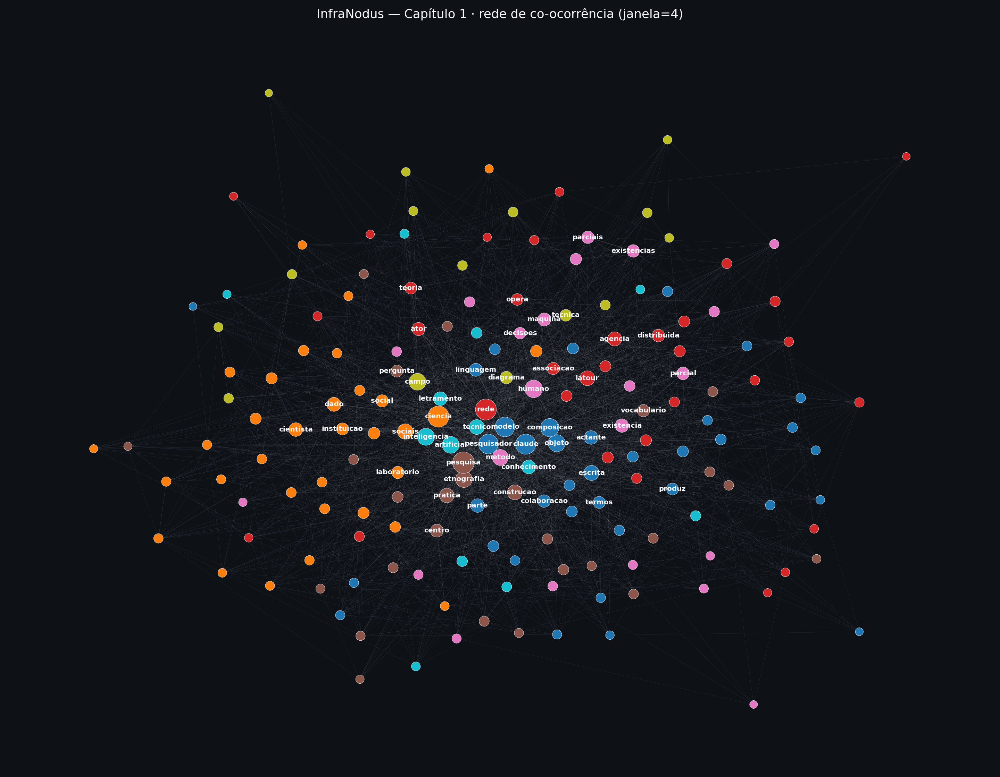
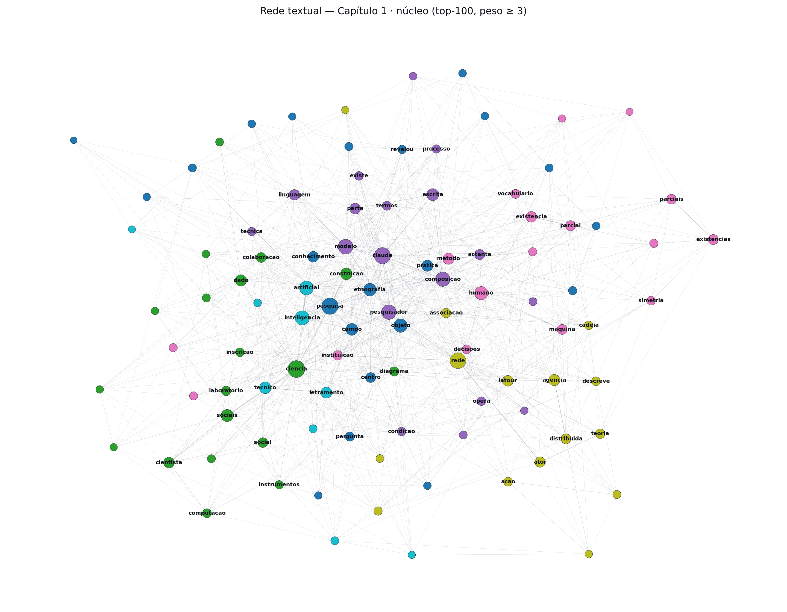
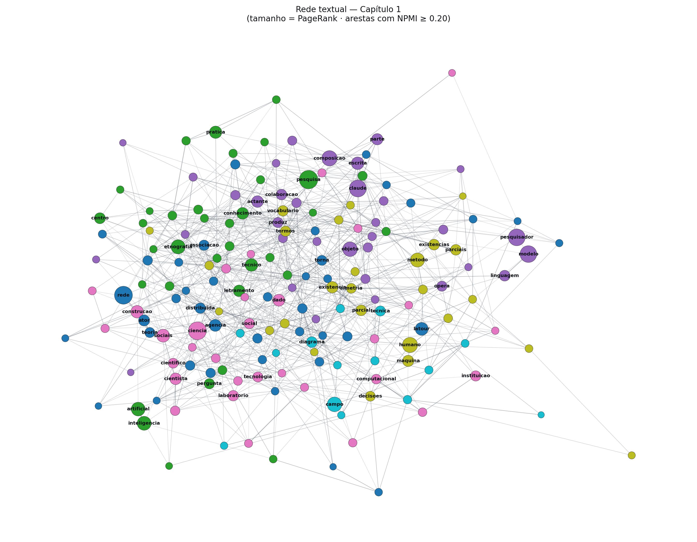
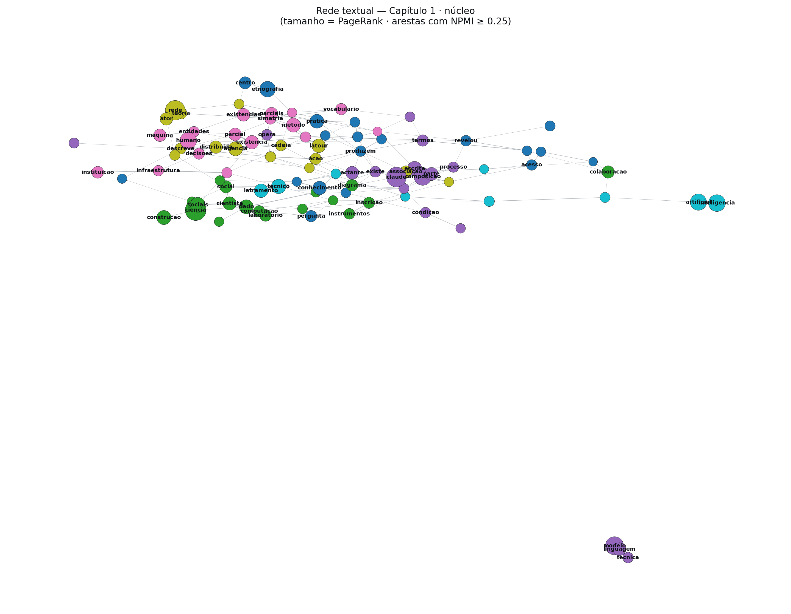
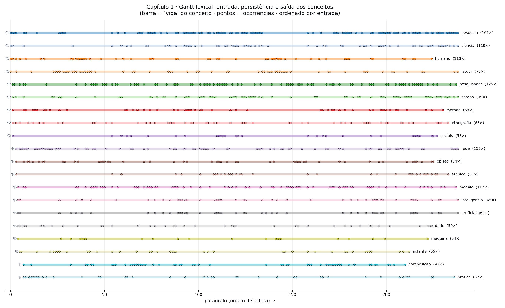
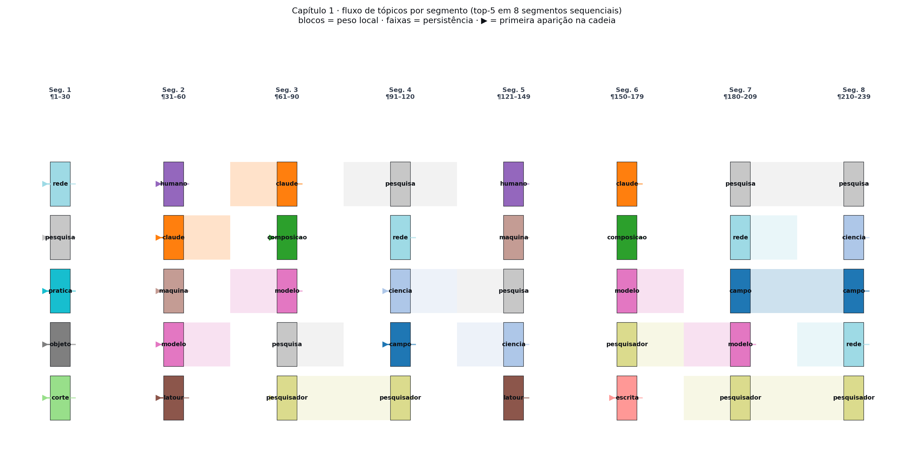
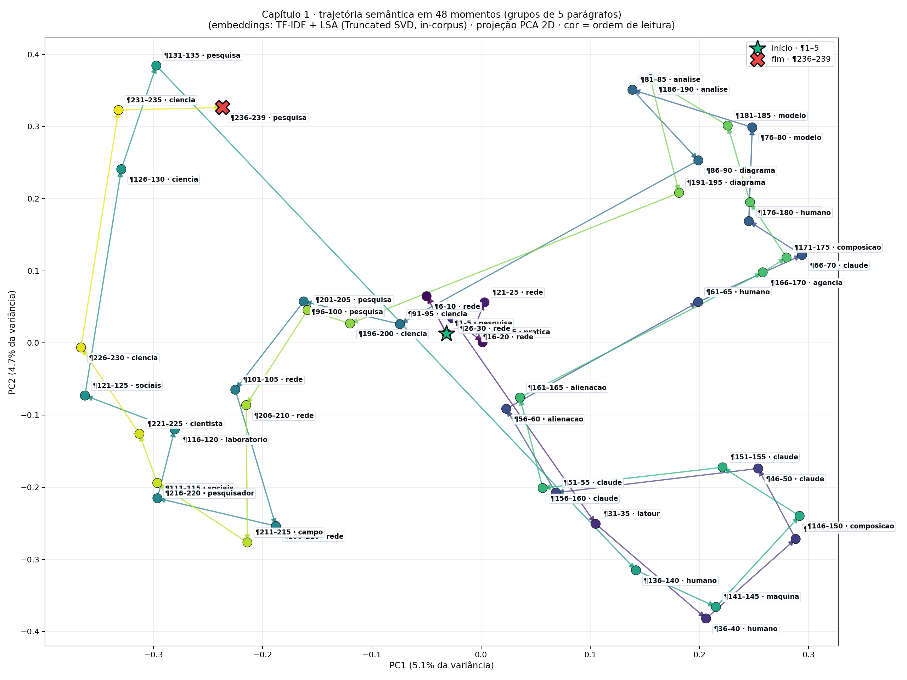

# Análise textual do Capítulo 1 — guia de interpretação

Este diretório reúne uma análise textual do **Capítulo 1** da tese
(`ex_cap1 - 2026-05-04T155948.717.tex`). A análise tem dois eixos
complementares:

1. **Análise de rede textual** (*text network analysis*) — cartografia
   estática dos conceitos como grafo de co-ocorrência. Responde:
   *quais ideias estão no centro do capítulo? como se agrupam? onde
   estão as lacunas argumentativas?*
2. **Análise de trajetória narrativa** — leitura sequencial. Responde:
   *por onde o capítulo começa, por onde termina, e como uma coisa vai
   linkando a outra ao longo da leitura?*

Este README orienta a leitura de **cada artefato gerado** e oferece
chaves interpretativas conectadas ao argumento da tese.

---

## Sumário

1. [Inventário de artefatos](#1-inventário-de-artefatos)
2. [Pipeline metodológico](#2-pipeline-metodológico)
3. [Como ler as figuras de rede](#3-como-ler-as-figuras-de-rede)
4. [Como ler as figuras de trajetória](#4-como-ler-as-figuras-de-trajetória)
5. [Glossário de métricas](#5-glossário-de-métricas)
6. [Achados principais](#6-achados-principais)
7. [Como reproduzir](#7-como-reproduzir)
8. [Como abrir no Gephi](#8-como-abrir-no-gephi)
9. [Integração na tese (LaTeX)](#9-integração-na-tese-latex)
10. [Referências](#10-referências)

---

## 1. Inventário de artefatos

### Scripts (Python, reproduzíveis)
| arquivo | função |
|---|---|
| `infranodus_cap1.py` | pré-processa o `.tex`, constrói o grafo de co-ocorrência, calcula métricas (degree, betweenness, PageRank, NPMI), detecta comunidades (Louvain), e exporta tudo |
| `narrative_trajectory.py` | extrai parágrafos preservando a ordem e gera as três visões sequenciais (Gantt, alluvial, trajetória semântica) |

### Visualizações de rede (estáticas, conceituais)
| arquivo | o que mostra | quando usar |
|---|---|---|
| `infranodus_cap1_network.png` | rede completa (180 nós), tamanho por **degree ponderado** | mapa amplo, inclui ruído periférico — bom para inspecionar lacunas |
| `infranodus_cap1_focus.png` | núcleo (top-100), peso ≥ 3 | apresentação, slides, recorte para a tese |
| `infranodus_cap1_pmi.png` | rede completa, tamanho por **PageRank**, arestas filtradas por **NPMI ≥ 0,20** | versão *informativa* — termos pouco frequentes mas estruturalmente importantes ganham destaque |
| `infranodus_cap1_focus_pmi.png` | núcleo, NPMI ≥ 0,25 | versão mais limpa, só associações fortes |

### Visualizações de trajetória (sequenciais, temporais)
| arquivo | o que mostra |
|---|---|
| `trajectory_gantt.png` | linha do tempo dos top-20 conceitos: parágrafo de **entrada** → **saída**, ticks em cada ocorrência |
| `trajectory_alluvial.png` | top-5 conceitos em cada um de 8 segmentos sequenciais; faixas mostram persistência |
| `trajectory_semantic.png` | 48 “momentos” (grupos de 5 parágrafos) projetados em 2D; arco marca o caminho semântico do início ao fim |

### Dados estruturados (para análise externa)
| arquivo | conteúdo |
|---|---|
| `infranodus_cap1_metrics.json` | métricas brutas de todos os nós, tópicos, lacunas e top NPMI |
| `infranodus_cap1.gexf` / `_focus.gexf` | grafos para o **Gephi**, com `community`, `frequency`, `degree_weighted`, `betweenness`, `pagerank` (nós) e `weight`, `npmi` (arestas) |
| `infranodus_cap1_nodes.csv` / `_edges.csv` (e `_focus_*`) | mesmas informações em planilha |
| `infranodus_cap1_report.md` | tabelas exaustivas de top termos, pontes, pares NPMI, comunidades e lacunas |

### Texto para a tese
| arquivo | conteúdo |
|---|---|
| `esboco_secao_infranodus.tex` | esboço de seção/interlúdio em LaTeX já com `\textcite{}`, figura, nota de rodapé metodológica e sugestões de BibTeX |

---

## 2. Pipeline metodológico

```
┌─ ex_cap1 - 2026-05-04T155948.717.tex
│
├──► [1] strip_latex
│     • remove \begin{...}, \end{...}, \cite, \ref, \label, \includegraphics
│     • desencapsula \footnote{...} → texto reincorporado ao corpus
│     • normaliza acentos, caixa baixa, hífens
│
├──► [2] tokenize + lemma
│     • stopwords PT+EN
│     • lematização leve (redes→rede, actantes→actante, modelos→modelo, ...)
│     • tokens com ≥ 4 caracteres
│
├──► [3] grafo de co-ocorrência (janela=4)
│     • para cada par (a,b) co-ocorrente em uma janela:
│         peso += 4 - distância   (3 / 2 / 1 conforme distância 1, 2, 3)
│
├──► [4] poda
│     • mantém top-180 nós por frequência
│     • descarta arestas com peso < 2
│     • mantém maior componente conexo
│
├──► [5] métricas
│     • degree ponderado (frequentista)
│     • PageRank com α=0.85         ← centralidade na rede
│     • betweenness com 1/peso       ← pontes
│     • NPMI por aresta              ← associação informativa
│     • Louvain ponderado            ← comunidades = tópicos
│
└──► [6] artefatos: PNG · GEXF · CSV · JSON · Markdown
```

A análise de trajetória (`narrative_trajectory.py`) reaproveita os
passos [1]–[2] mas **preserva a ordem dos parágrafos**, o que o pipeline
de rede descarta. A partir daí:

- **Gantt** olha cada conceito ao longo do tempo do capítulo.
- **Alluvial** divide o capítulo em 8 segmentos e ranqueia conceitos
  dentro de cada segmento.
- **Trajetória semântica** agrupa parágrafos em momentos de 5, embute
  cada momento (TF-IDF + LSA, ou *sentence-transformer* quando
  disponível), e projeta em 2D via PCA.

---

## 3. Como ler as figuras de rede

### 3.1 `infranodus_cap1_network.png` — rede completa



**O que cada elemento significa**
- **Nó** = um conceito (lema). **Tamanho** = degree ponderado (mais
  conexões mais fortes = nó maior).
- **Cor** = comunidade detectada por Louvain. Cada cor é um *tópico
  latente* que o algoritmo identificou como um sub-grupo bem
  conectado internamente.
- **Aresta** = co-ocorrência dentro da janela de 4 tokens. **Espessura**
  = peso bruto da co-ocorrência.
- **Posição** = layout *spring* (ForceAtlas-like): nós muito
  conectados se atraem, nós sem ligação se afastam. Não tem eixo
  semântico fixo — só a topologia importa.

**Como ler**
1. Olhe os 5–10 nós maiores: são o **núcleo conceitual** do capítulo.
2. Identifique as **cores principais**: cada cor é um tópico. Os 6
   tópicos detectados (versão atual) são:

   | tópico | rótulo (top-6 termos) |
   |---|---|
   | T1 (40) | rede, latour, agência, ator, distribuída, associação |
   | T2 (35) | pesquisa, inteligência, artificial, etnografia, técnico, prática |
   | T3 (34) | claude, pesquisador, modelo, composição, objeto, escrita |
   | T4 (31) | ciência, sociais, construção, dado, cientista, laboratório |
   | T5 (26) | humano, método, existência, máquina, parcial, existências |
   | T6 (14) | campo, diagrama, técnica, visível, tornava, alienação |

3. Identifique os nós **na fronteira entre cores** — são as **pontes**
   (alta *betweenness*). Funcionam como tradutores entre tópicos.
4. Onde houver **gaps visuais** (espaços em branco entre clusters),
   há *lacunas estruturais*: ideias que o capítulo aproxima pouco.

### 3.2 `infranodus_cap1_focus.png` — núcleo



Mesma lógica, mas só os 100 nós com maior degree e arestas com
peso ≥ 3. **Use esta versão para apresentação ou para a tese** — a
estrutura argumentativa fica visível sem o ruído da periferia.

### 3.3 `infranodus_cap1_pmi.png` — rede ponderada por informação



**Diferença crítica em relação à 3.1:** aqui o tamanho do nó é o
**PageRank** (centralidade na rede, independente de frequência) e
**só sobrevivem arestas com NPMI ≥ 0,20** (associações realmente
surpreendentes, mesmo que pouco frequentes).

**Por que isso importa**
A rede frequentista (3.1) é dominada por palavras comuns. A rede PMI
(3.3) revela **associações semanticamente fortes** que ficam
escondidas no peso bruto:

| par | NPMI | co-ocorrências |
|---|---|---|
| `existência` ↔ `parcial` (Strathern!) | 0,77 | 64 |
| `teoria` ↔ `ator` | 0,74 | 60 |
| `agência` ↔ `distribuída` | 0,70 | 58 |
| `técnico` ↔ `letramento` | 0,68 | 80 |
| `ausência` ↔ `presença` (Law/Mol) | **0,63** | só **23** |
| `ontologia` ↔ `multiplicidade` (Mol) | **0,60** | só **23** |
| `alienação` ↔ `Simondon` | **0,59** | só **14** |

Os três pares em destaque co-ocorrem **pouco** mas têm NPMI alto:
são associações *teóricas* significativas que a frequência bruta
apaga. A presença de `ontologia ↔ multiplicidade` é Mol; `ausência
↔ presença` é Law/Mol; `alienação ↔ Simondon` localiza uma promessa
teórica específica do capítulo.

### 3.4 `infranodus_cap1_focus_pmi.png` — núcleo informativo



Versão mais limpa da anterior, NPMI ≥ 0,25. **Provavelmente a melhor
figura para a tese** se o objetivo é ilustrar a *estrutura argumentativa*
em vez do *vocabulário do capítulo*.

---

## 4. Como ler as figuras de trajetória

### 4.1 `trajectory_gantt.png` — linha do tempo dos conceitos



**O que cada elemento significa**
- Eixo X = parágrafo (1 a ~239).
- Cada **linha horizontal** = um conceito. A barra colorida vai do
  parágrafo de **primeira aparição** até o de **última aparição**.
- **Ticks** dentro da barra = cada ocorrência individual do conceito.
- Os conceitos são **ordenados por entrada** (de cima para baixo, na
  ordem em que aparecem pela primeira vez no capítulo).

**Como ler**
1. **Conceitos *fundadores*** — aparecem nas primeiras linhas:
   `pesquisa`, `ciência`, `humano`, `latour`, `pesquisador`. Estão
   presentes desde os primeiros parágrafos e atravessam o capítulo
   inteiro.
2. **Conceitos *adquiridos*** — aparecem mais abaixo: `etnografia`,
   `método`, `actante`, `composição`, `prática`. São construídos ao
   longo da leitura, não pressupostos.
3. **Densidade dos ticks** mostra onde cada conceito *concentra*
   sua atenção. Se há um trecho com muitos ticks seguidos, é onde o
   capítulo *para para tratar daquilo*.
4. **Vazios na barra** indicam suspensões temporárias do conceito —
   ele ressurgirá depois.

**Para a tese**: este gráfico ajuda a identificar **a arquitetura
argumentativa** do capítulo. Se um conceito que você considera
central aparece tarde e sai cedo, há um problema de proporcionalidade
entre tese e prosa.

### 4.2 `trajectory_alluvial.png` — fluxo entre segmentos



**O que cada elemento significa**
- 8 colunas = 8 segmentos sequenciais do capítulo (~30 parágrafos
  cada). Os limites estão em cima de cada coluna (ex.: “Seg. 3
  ¶61–90”).
- Cada **bloco colorido** = um dos 5 conceitos mais frequentes
  *naquele segmento*. A cor é constante por conceito (mesmo bloco
  azul = mesma palavra entre segmentos).
- **Faixa colorida** entre dois blocos adjacentes = persistência: o
  conceito sobreviveu de um segmento para o seguinte.
- **▶** à esquerda de um bloco = *primeira aparição* desse conceito
  na cadeia top-5 (entrada).

**Como ler**
1. **Conceitos persistentes** atravessam o capítulo como faixas
   contínuas — são vetores estáveis do argumento.
2. **Conceitos pulsantes** aparecem, somem, ressurgem — são objetos
   de retorno (geralmente vinculados a digressões ou notas longas).
3. **Conceitos *de chegada*** (▶ apenas em segmentos finais) revelam
   ideias *introduzidas tarde*. Se uma promessa de capítulo só
   aparece no segmento 6 ou 7, vale conferir se a transição é
   suficiente.
4. **A última coluna** (Seg. 8) revela com que vocabulário o capítulo
   *fecha*. Comparar com a primeira coluna mostra o *deslocamento*
   conceitual que o capítulo opera.

### 4.3 `trajectory_semantic.png` — arco semântico



**O que cada elemento significa**
- Cada **ponto** = um “momento” (grupo de 5 parágrafos consecutivos).
- A **posição** é dada por embeddings TF-IDF + LSA (ou
  *sentence-transformer* quando disponível) projetados em PCA 2D.
  Dois momentos próximos no plano falam de coisas semelhantes.
- A **cor** vai do escuro (início) ao amarelo (fim) — gradiente
  *viridis*.
- **★ verde** = início do capítulo. **✕ vermelho** = fim.
- **Setas** conectam momentos consecutivos (ordem de leitura).

**Como ler**
1. **Comprimento da trajetória**: muitas idas e vindas (linhas
   longas atravessando o plano) indicam que o capítulo não progride
   linearmente — há retornos, espirais, voltas.
2. **Aglomerações**: grupos densos de pontos próximos = um *bloco
   temático* coeso. O capítulo *para nesse tema*.
3. **Posição relativa de ★ e ✕**: se estão em regiões opostas, o
   capítulo *desloca* o leitor — termina em outro lugar conceitual.
   Se estão próximos, o capítulo *fecha o círculo*.
4. **Arcos longos isolados**: digressões. Há uma seta longa para um
   ponto solitário e depois outra de volta.

> No caso do Capítulo 1: ★ inicia ancorado em `rede`, percorre um
> grande arco passando por `humano/máquina/Latour/Claude` (lado
> direito, vocabulário ATR + IA), depois desliza para a esquerda
> via `social/pesquisador/laboratório/campo`, e ✕ termina perto de
> `pesquisa/ciência`. O fim está semanticamente longe do início —
> o capítulo **desloca**, não fecha.

> **Importante:** o título do gráfico diz qual método foi usado para
> os embeddings. Em sandbox sem internet, é `TF-IDF + LSA`. Rode
> localmente para ter os embeddings *sentence-transformer*.

---

## 5. Glossário de métricas

| métrica | o que mede | quando privilegiar |
|---|---|---|
| **degree ponderado** | soma dos pesos das arestas que tocam um nó. Aproximação simples de “importância”. | Para *baseline frequentista*. |
| **PageRank** | importância recursiva: um nó é importante se outros importantes apontam para ele. Independente da frequência bruta. | Para revelar **termos pouco frequentes mas estruturalmente centrais**. |
| **betweenness centrality** | proporção de caminhos mais curtos entre pares de nós que passam por um dado nó. | Identifica **pontes** entre tópicos — termos tradutores. |
| **NPMI** (*Normalized Pointwise Mutual Information*) | mede se duas palavras co-ocorrem **mais do que o esperado** dadas suas frequências individuais. Range \[−1, 1\]. | Aresta com NPMI alto = associação **semanticamente forte**, mesmo se rara. |
| **Louvain** | algoritmo de detecção de comunidades por otimização gulosa de modularidade. | Tópicos latentes do grafo. |
| **Modularidade** | quão bem o grafo se divide em comunidades. > 0,3 ≈ estrutura comunitária real. | Diagnóstico do grau de “tematização” do texto. |
| **Lacuna estrutural** | par de comunidades com baixa densidade de arestas entre si. | Sinaliza **espaços de ideia pouco articulados** — agenda de revisão. |
| **TF-IDF + LSA** | embedding estatístico de cada parágrafo num espaço de baixa dimensão. | Posicionar parágrafos no plano semântico, sem rede externa. |
| **PCA** | projeção linear que preserva a variância máxima em poucos eixos. | Visualizar embeddings em 2D. |

---

## 6. Achados principais

### 6.1 Núcleo conceitual
Os 10 termos com maior degree ponderado são `pesquisa`, `ciência`,
`rede`, `claude`, `pesquisador`, `modelo`, `composição`, `humano`,
`objeto`, `inteligência`. **Quatro famílias** convivem nesse núcleo:
ciências sociais (`ciência`, `pesquisador`, `sociais`), teoria
ator-rede (`rede`, `actante`, `Latour`), inteligência artificial
(`modelo`, `inteligência`, `artificial`, `Claude`) e
escrita-como-prática (`composição`, `escrita`, `objeto`).

### 6.2 Pontes argumentativas
Os termos com maior betweenness são `ciência`, `pesquisa`, `claude`,
`rede`, `pesquisador`, `objeto`. Curiosamente, **as pontes não são
os conceitos teoricamente densos** (Latour, Stengers, Mol); são
palavras-coringa cuja função é justamente *circular* entre os
sub-vocabulários. Isso é informação útil: se quiser que um conceito
teórico denso ocupe posição de ponte, ele precisa aparecer em mais
de um sub-grupo.

### 6.3 Pares semanticamente surpreendentes (NPMI)
Pares que co-ocorrem **pouco** mas em forte associação:
- `ontologia ↔ multiplicidade` (Mol) — 23 co-ocorrências, NPMI 0,60
- `ausência ↔ presença` (Law/Mol) — 23 co-ocorrências, NPMI 0,63
- `alienação ↔ Simondon` — 14 co-ocorrências, NPMI 0,59

Esses pares são **pequenos polos teóricos** que existem no capítulo
mas estão sub-representados no peso bruto. Decidir se devem ser
amplificados ou se já cumprem sua função pontual é uma decisão
editorial.

### 6.4 Lacuna estrutural mais forte
Entre o tópico **ciências sociais / campo / sociais / dado**
e o tópico **humano / método / existência / máquina / parcial**, a
densidade ponderada de ligação é a mais baixa entre os pares de
tópicos grandes. **Esse é o achado mais relevante para o argumento**:
o vocabulário das ciências sociais com que você escreve e o
vocabulário da simetria humano/não-humano com que você prometeu
escrever ainda não estão suficientemente costurados. O `method
assemblage` de Law oferece a moldura para nomear o que isso quer
dizer no capítulo seguinte.

### 6.5 Arquitetura temporal
- **Conceitos *fundadores*** (entram cedo, ficam até o fim):
  `pesquisa`, `ciência`, `humano`, `Latour`, `pesquisador`.
- **Conceitos *adquiridos*** (entram a partir do meio): `método`,
  `actante`, `composição`, `prática`.
- **Conceitos *de retorno*** (somem e voltam): `Simondon`/`alienação`
  no segmento 5–6 (é a promessa teórica que precisa de costura).
- **Conceitos *de fechamento*** (dominantes no segmento 8):
  `pesquisa`, `ciência`, `campo`, `rede`. O capítulo termina
  reforçando o vocabulário de campo/ciência, não o de IA.

### 6.6 Trajetória semântica
O capítulo **não fecha o círculo**. Começa em `rede` (vocabulário
ATR), passa por um grande arco de `humano/máquina/Latour/Claude`
(simetria + IA), e termina em `pesquisa/ciência`
(ciências sociais / campo). O leitor é deslocado, não devolvido ao
ponto de partida — o que combina com a aposta interpretativa do
capítulo: é um capítulo de **passagem**, do vocabulário ATR para o
vocabulário de campo.

---

## 7. Como reproduzir

```bash
# Pré-requisitos (uma vez):
pip install networkx matplotlib numpy unidecode scipy scikit-learn
# Opcional (para embeddings transformer):
pip install sentence-transformers

# Rodar a análise de rede:
python3 infranodus/infranodus_cap1.py

# Rodar a análise de trajetória:
python3 infranodus/narrative_trajectory.py
```

Cada script reescreve seus próprios PNGs / GEXF / CSV / JSON. As
duas análises são independentes; a de trajetória apenas reaproveita
funções de limpeza do módulo `infranodus_cap1.py`.

**Reprodutibilidade**: as comunidades Louvain dependem de uma semente
aleatória; a semente está fixada em 7. Pequenas variações entre
execuções (ex.: 5 ou 6 comunidades) são esperadas e indicam apenas
que duas comunidades adjacentes estão na fronteira do limiar de
modularidade.

---

## 8. Como abrir no Gephi

1. Instale o [Gephi (≥ 0.10)](https://gephi.org/users/download/).
2. `File → Open…` → escolha `infranodus_cap1.gexf` (ou `_focus.gexf`).
3. Em **Appearance**:
   - **Nodes → Color → Partition → community** → *Apply*.
   - **Nodes → Size → Ranking → degree_weighted** *ou* **pagerank**
     (min 8, max 60) → *Apply*.
   - **Nodes → Label Size → Ranking → pagerank** → *Apply*.
4. Em **Layout**: **ForceAtlas 2** com *Prevent Overlap* + *Dissuade
   Hubs*, ~30 segundos.
5. Em **Statistics** (à direita): rode *Modularity* (deve dar valor
   próximo de 0,4–0,5; comunidades semelhantes às pré-calculadas).
6. Aba **Filters** (à direita): aplique *Edges → Edge Weight* (≥ 3)
   ou *Attributes → Equal → npmi* (≥ 0,2) para versões mais limpas.
7. Em **Preview**: ative *Show Labels*, escolha tema, exporte para
   PDF/SVG via `File → Export → SVG/PDF/PNG file…`.

> Os atributos `pagerank` e `npmi` foram embutidos no GEXF
> propositalmente para que você possa **trocar o critério de tamanho
> e de filtragem dentro do Gephi** sem precisar re-exportar o grafo.

---

## 9. Integração na tese (LaTeX)

O arquivo `esboco_secao_infranodus.tex` traz um **interlúdio
reflexivo curto** pronto para ser inserido no Capítulo 1 logo após
a passagem em que você diz que “esta tese tornou-se também uma
inscrição tecnocientífica”. O esboço:

- Ancora o gesto em Latour (1986, *Visualization and Cognition*) e
  na noção de **inscrição como móvel imutável**.
- Nomeia o método pelo termo correto: **análise de rede textual**
  (*text network analysis*), com sua genealogia em Ferrer i Cancho
  & Solé (2001), Diesner & Carley (2005), Paranyushkin (2019) e
  Blondel et al. (2008) para o Louvain.
- Mostra os números (top-degree, top-betweenness, top-NPMI), os 6
  tópicos detectados, e nomeia explicitamente a **lacuna estrutural
  entre o vocabulário das ciências sociais e o vocabulário do
  humano/máquina/método** como achado argumentativo.
- Inclui uma figura (`\begin{figure}` apontando para
  `figuras/cap.1/infranodus_cap1_focus.png`).
- Reconhece o paradoxo de aplicar análise de *rede* a um capítulo
  sobre teoria *ator-rede*, e usa Latour (2005, *Reassembling the
  Social*, pp. 129–132) para distinguir os dois sentidos de “rede”.
- Bloco final com 4 entradas BibTeX prontas.

**Antes de compilar**:
```bash
cp infranodus/infranodus_cap1_focus.png figuras/cap.1/infranodus_cap1_focus.png
```
e cole o conteúdo do `.tex` no seu capítulo, ou use `\input{infranodus/esboco_secao_infranodus}`.

---

## 10. Referências

- **Blondel, V. D., Guillaume, J.-L., Lambiotte, R., & Lefebvre, E.**
  (2008). Fast unfolding of communities in large networks. *Journal of
  Statistical Mechanics: Theory and Experiment*, 2008(10), P10008.
- **Diesner, J., & Carley, K. M.** (2005). Revealing social structure
  from texts: Meta-matrix text analysis as a novel method for network
  text analysis. In V. K. Narayanan & D. J. Armstrong (Eds.), *Causal
  Mapping for Information Systems and Technology Research*. Idea Group
  Publishing.
- **Ferrer i Cancho, R., & Solé, R. V.** (2001). The small world of
  human language. *Proceedings of the Royal Society B*, 268(1482),
  2261–2265.
- **Latour, B.** (1986). Visualization and Cognition: Drawing Things
  Together. *Knowledge and Society*, 6, 1–40.
- **Paranyushkin, D.** (2019). InfraNodus: Generating Insight Using
  Text Network Analysis. In *The World Wide Web Conference (WWW '19)*
  (pp. 3584–3589). ACM.

---

*Branch: `claude/infranodus-thesis-chapter-1-VV43B` ·
gerado pela combinação de `infranodus_cap1.py` e `narrative_trajectory.py`.*
